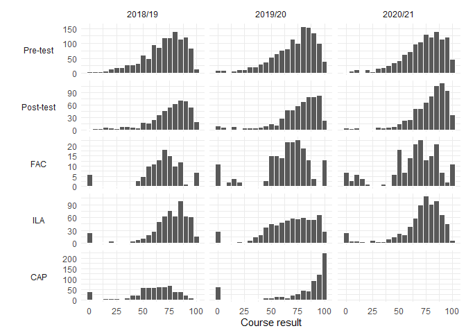

STUMBL: Prepare data
================
George Kinnear
26/03/2021

# Data sources

## Diagnostic Test response data

Number of responses:

<table class="table table-striped" style="width: auto !important; margin-left: auto; margin-right: auto;">

<thead>

<tr>

<th style="text-align:left;">

cohort

</th>

<th style="text-align:left;">

diet

</th>

<th style="text-align:right;">

n

</th>

<th style="text-align:right;">

diagtest\_mean

</th>

<th style="text-align:right;">

diagtest\_sd

</th>

</tr>

</thead>

<tbody>

<tr>

<td style="text-align:left;vertical-align: top !important;" rowspan="2">

1819

</td>

<td style="text-align:left;">

Pre

</td>

<td style="text-align:right;">

1160

</td>

<td style="text-align:right;">

69.56774

</td>

<td style="text-align:right;">

19.94345

</td>

</tr>

<tr>

<td style="text-align:left;">

Post

</td>

<td style="text-align:right;">

525

</td>

<td style="text-align:right;">

74.71251

</td>

<td style="text-align:right;">

19.67862

</td>

</tr>

<tr>

<td style="text-align:left;vertical-align: top !important;" rowspan="2">

1920

</td>

<td style="text-align:left;">

Pre

</td>

<td style="text-align:right;">

1239

</td>

<td style="text-align:right;">

71.19954

</td>

<td style="text-align:right;">

20.66275

</td>

</tr>

<tr>

<td style="text-align:left;">

Post

</td>

<td style="text-align:right;">

605

</td>

<td style="text-align:right;">

75.04688

</td>

<td style="text-align:right;">

21.21190

</td>

</tr>

<tr>

<td style="text-align:left;vertical-align: top !important;" rowspan="2">

2021

</td>

<td style="text-align:left;">

Pre

</td>

<td style="text-align:right;">

1186

</td>

<td style="text-align:right;">

72.28230

</td>

<td style="text-align:right;">

19.77236

</td>

</tr>

<tr>

<td style="text-align:left;">

Post

</td>

<td style="text-align:right;">

709

</td>

<td style="text-align:right;">

78.26884

</td>

<td style="text-align:right;">

17.94828

</td>

</tr>

</tbody>

</table>

## Demographic data

We have demographic data available – while we don’t make use of this in
analyses, we need to use this to determine which students are enrolled
on which courses in each year, particularly for 2020/21 CAP where there
are no results available for that yet.

<table class="table table-striped" style="width: auto !important; margin-left: auto; margin-right: auto;">

<thead>

<tr>

<th style="text-align:left;">

course

</th>

<th style="text-align:right;">

1819

</th>

<th style="text-align:right;">

1920

</th>

<th style="text-align:right;">

2021

</th>

</tr>

</thead>

<tbody>

<tr>

<td style="text-align:left;">

CAP

</td>

<td style="text-align:right;">

590

</td>

<td style="text-align:right;">

695

</td>

<td style="text-align:right;">

752

</td>

</tr>

<tr>

<td style="text-align:left;">

FAC

</td>

<td style="text-align:right;">

111

</td>

<td style="text-align:right;">

182

</td>

<td style="text-align:right;">

180

</td>

</tr>

<tr>

<td style="text-align:left;">

ILA

</td>

<td style="text-align:right;">

602

</td>

<td style="text-align:right;">

682

</td>

<td style="text-align:right;">

726

</td>

</tr>

</tbody>

</table>

## All course results

<table class="table table-striped" style="width: auto !important; margin-left: auto; margin-right: auto;">

<thead>

<tr>

<th style="text-align:left;">

cohort

</th>

<th style="text-align:right;">

CAP

</th>

<th style="text-align:right;">

FAC

</th>

<th style="text-align:right;">

ILA

</th>

<th style="text-align:right;">

Total

</th>

</tr>

</thead>

<tbody>

<tr>

<td style="text-align:left;">

1819

</td>

<td style="text-align:right;">

595

</td>

<td style="text-align:right;">

111

</td>

<td style="text-align:right;">

605

</td>

<td style="text-align:right;">

1311

</td>

</tr>

<tr>

<td style="text-align:left;">

1920

</td>

<td style="text-align:right;">

698

</td>

<td style="text-align:right;">

182

</td>

<td style="text-align:right;">

684

</td>

<td style="text-align:right;">

1564

</td>

</tr>

<tr>

<td style="text-align:left;">

2021

</td>

<td style="text-align:right;">

0

</td>

<td style="text-align:right;">

180

</td>

<td style="text-align:right;">

726

</td>

<td style="text-align:right;">

906

</td>

</tr>

<tr>

<td style="text-align:left;">

Total

</td>

<td style="text-align:right;">

1293

</td>

<td style="text-align:right;">

473

</td>

<td style="text-align:right;">

2015

</td>

<td style="text-align:right;">

3781

</td>

</tr>

</tbody>

</table>

Combining these with Diagnostic Test pre/post results:

<table class="table table-striped" style="width: auto !important; margin-left: auto; margin-right: auto;">

<caption>

Table 3 in the paper

</caption>

<thead>

<tr>

<th style="empty-cells: hide;border-bottom:hidden;" colspan="1">

</th>

<th style="border-bottom:hidden;padding-bottom:0; padding-left:3px;padding-right:3px;text-align: center; " colspan="2">

2018/19

</th>

<th style="border-bottom:hidden;padding-bottom:0; padding-left:3px;padding-right:3px;text-align: center; " colspan="2">

2019/20

</th>

<th style="border-bottom:hidden;padding-bottom:0; padding-left:3px;padding-right:3px;text-align: center; " colspan="2">

2020/21

</th>

</tr>

<tr>

<th style="text-align:left;">

</th>

<th style="text-align:right;">

N

</th>

<th style="text-align:left;">

Took Pre-test

</th>

<th style="text-align:right;">

N

</th>

<th style="text-align:left;">

Took Pre-test

</th>

<th style="text-align:right;">

N

</th>

<th style="text-align:left;">

Took Pre-test

</th>

</tr>

</thead>

<tbody>

<tr>

<td style="text-align:left;">

All students

</td>

<td style="text-align:right;">

696

</td>

<td style="text-align:left;">

519 (75%)

</td>

<td style="text-align:right;">

832

</td>

<td style="text-align:left;">

585 (70%)

</td>

<td style="text-align:right;">

872

</td>

<td style="text-align:left;">

579 (66%)

</td>

</tr>

<tr>

<td style="text-align:left;">

Took Post-test

</td>

<td style="text-align:right;">

517

</td>

<td style="text-align:left;">

421 (81%)

</td>

<td style="text-align:right;">

594

</td>

<td style="text-align:left;">

471 (79%)

</td>

<td style="text-align:right;">

696

</td>

<td style="text-align:left;">

509 (73%)

</td>

</tr>

<tr>

<td style="text-align:left;">

FAC

</td>

<td style="text-align:right;">

111

</td>

<td style="text-align:left;">

90 (81%)

</td>

<td style="text-align:right;">

182

</td>

<td style="text-align:left;">

109 (60%)

</td>

<td style="text-align:right;">

180

</td>

<td style="text-align:left;">

91 (51%)

</td>

</tr>

<tr>

<td style="text-align:left;">

ILA

</td>

<td style="text-align:right;">

605

</td>

<td style="text-align:left;">

497 (82%)

</td>

<td style="text-align:right;">

683

</td>

<td style="text-align:left;">

545 (80%)

</td>

<td style="text-align:right;">

726

</td>

<td style="text-align:left;">

555 (76%)

</td>

</tr>

<tr>

<td style="text-align:left;">

CAP

</td>

<td style="text-align:right;">

593

</td>

<td style="text-align:left;">

457 (77%)

</td>

<td style="text-align:right;">

695

</td>

<td style="text-align:left;">

519 (75%)

</td>

<td style="text-align:right;">

  - 
    
    </td>
    
    <td style="text-align:left;">
    
      - 
        
        </td>
        
        </tr>
        
        </tbody>
        
        </table>

## Results distributions

Histograms of results in each of the three courses:

<!-- -->

# Students with pre-post data

For pre-post analyses, we restrict to students who were enrolled on one
of FAC/ILA/CAP (i.e. to exclude the many engineering students who only
take the diagnostic test in September).

We assemble the available data for exploring the "“FAC Effect”", saving
it as `data-ANON/ANON_student-data.csv`.

<table class="table table-striped" style="width: auto !important; margin-left: auto; margin-right: auto;">

<thead>

<tr>

<th style="text-align:left;">

meas

</th>

<th style="text-align:right;">

N\_total

</th>

<th style="text-align:right;">

N\_with\_Pre

</th>

<th style="text-align:right;">

pc

</th>

</tr>

</thead>

<tbody>

<tr>

<td style="text-align:left;">

Post

</td>

<td style="text-align:right;">

1807

</td>

<td style="text-align:right;">

1401

</td>

<td style="text-align:right;">

0.7753182

</td>

</tr>

<tr>

<td style="text-align:left;">

ILA

</td>

<td style="text-align:right;">

2014

</td>

<td style="text-align:right;">

1597

</td>

<td style="text-align:right;">

0.7929494

</td>

</tr>

<tr>

<td style="text-align:left;">

CAP

</td>

<td style="text-align:right;">

1288

</td>

<td style="text-align:right;">

976

</td>

<td style="text-align:right;">

0.7577640

</td>

</tr>

</tbody>

</table>
