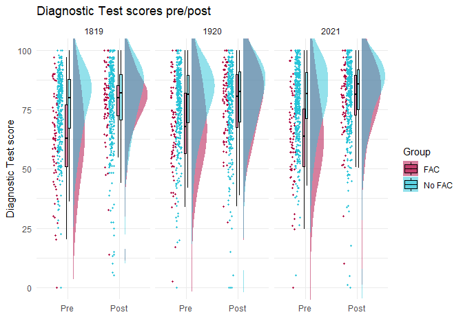
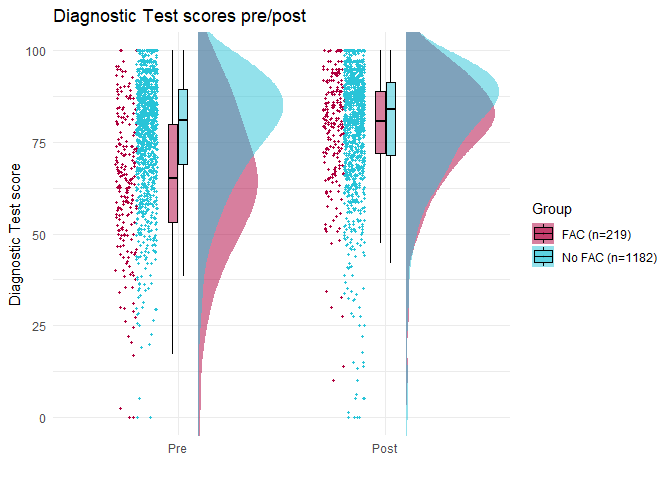
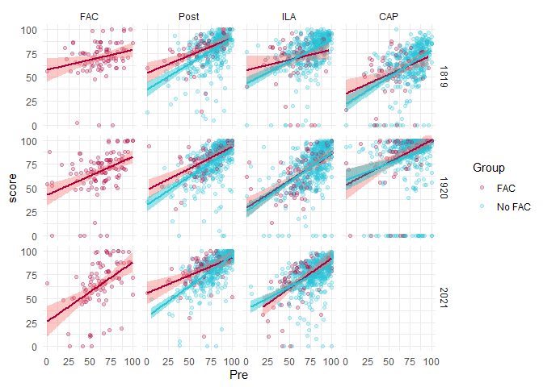
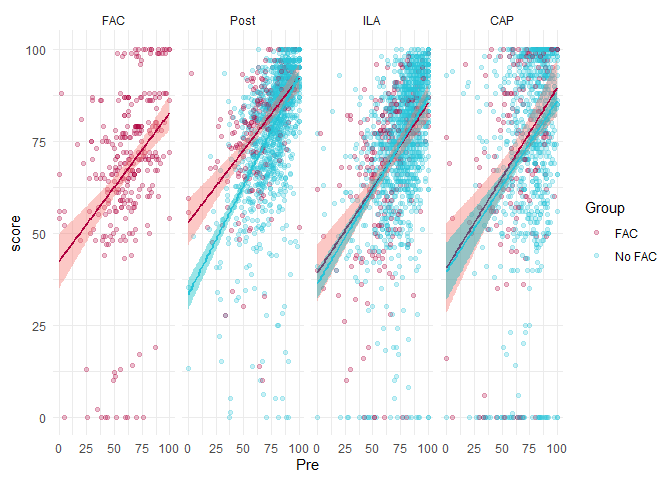
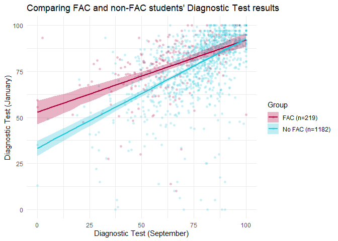
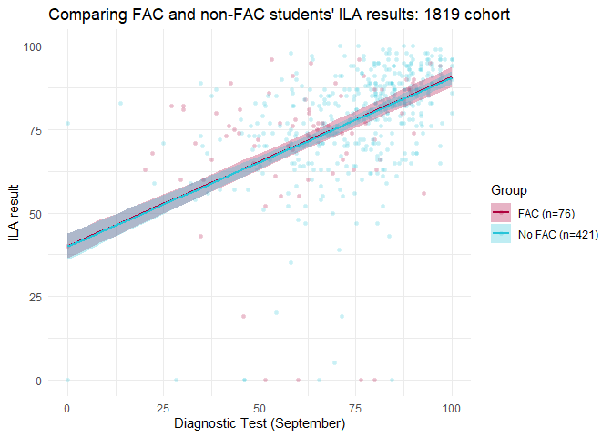
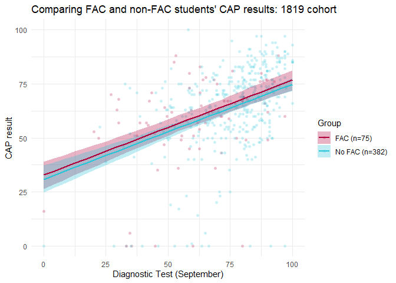
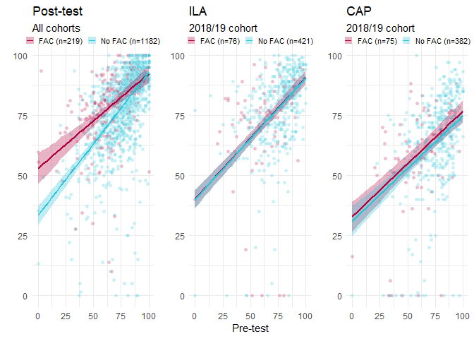

STUMBL: Regression analysis
================
George Kinnear
26/03/2021

# Exploring the FAC Effect

### Raincloud plot

This shows the pattern of Pre/Post results for each cohort:

<!-- -->

Here we group the cohorts together – this is Figure 2 in the paper:

<!-- -->

### Regression plots

These plots show the various outcome measures in relation to Pre-test
scores. The first plot splits up the cohorts for a visual check that
they are consistent, and the second one shows the results for all
cohorts grouped together.

<!-- --><!-- -->

Now we will do the main Bayesian analyses.

## Post-test

### Linear regression

We try fitting different models, starting with the “full” model `Post ~
Pre + took_FAC + Pre:took_FAC + cohort` and comparing this against
models that remove the `cohort` and interaction terms.

    ## Bayes factor analysis
    ## --------------
    ## [1] Pre + took_FAC + Pre:took_FAC + cohort : 1.789388e+106 ±1.2%
    ## [2] Pre + took_FAC + cohort                : 5.464221e+104 ±2.23%
    ## [3] Pre + took_FAC + Pre:took_FAC          : 2.288939e+106 ±0.86%
    ## [4] Pre + took_FAC                         : 4.707724e+104 ±2.34%
    ## [5] Pre                                    : 9.248542e+98  ±0%
    ## [6] took_FAC                               : 0.1387305     ±0%
    ## [7] Pre * took_FAC * cohort                : 8.116636e+100 ±4.84%
    ## [8] Pre + took_FAC + cohort #1             : 5.425423e+104 ±1.64%
    ## 
    ## Against denominator:
    ##   Intercept only 
    ## ---
    ## Bayes factor type: BFlinearModel, JZS

<table class="table table-striped" style="width: auto !important; margin-left: auto; margin-right: auto;">

<thead>

<tr>

<th style="text-align:left;">

Model

</th>

<th style="text-align:right;">

BF

</th>

<th style="text-align:left;">

interp

</th>

</tr>

</thead>

<tbody>

<tr>

<td style="text-align:left;">

Pre + took\_FAC + cohort

</td>

<td style="text-align:right;">

1.0000000

</td>

<td style="text-align:left;">

no evidence against or in favour of

</td>

</tr>

<tr>

<td style="text-align:left;">

Pre + took\_FAC + Pre:took\_FAC + cohort

</td>

<td style="text-align:right;">

32.9815336

</td>

<td style="text-align:left;">

very strong evidence in favour of

</td>

</tr>

<tr>

<td style="text-align:left;">

Pre + took\_FAC + cohort

</td>

<td style="text-align:right;">

1.0000000

</td>

<td style="text-align:left;">

no evidence against or in favour of

</td>

</tr>

<tr>

<td style="text-align:left;">

Pre + took\_FAC + Pre:took\_FAC

</td>

<td style="text-align:right;">

42.1891241

</td>

<td style="text-align:left;">

very strong evidence in favour of

</td>

</tr>

<tr>

<td style="text-align:left;">

Pre + took\_FAC

</td>

<td style="text-align:right;">

0.8677155

</td>

<td style="text-align:left;">

anecdotal evidence against

</td>

</tr>

<tr>

<td style="text-align:left;">

Pre

</td>

<td style="text-align:right;">

0.0000017

</td>

<td style="text-align:left;">

extreme evidence against

</td>

</tr>

<tr>

<td style="text-align:left;">

took\_FAC

</td>

<td style="text-align:right;">

0.0000000

</td>

<td style="text-align:left;">

extreme evidence against

</td>

</tr>

<tr>

<td style="text-align:left;">

Pre \* took\_FAC \* cohort

</td>

<td style="text-align:right;">

0.0001496

</td>

<td style="text-align:left;">

extreme evidence against

</td>

</tr>

<tr>

<td style="text-align:left;">

Pre + took\_FAC + cohort

</td>

<td style="text-align:right;">

1.0000000

</td>

<td style="text-align:left;">

no evidence against or in favour of

</td>

</tr>

</tbody>

</table>

There is very strong evidence for including the interaction between
Pre-test and `took_FAC`. While it looks like there is strong evidence in
favour of including the `cohort` in the model, that is just because it
is part of a model that includes in the interaction term too – the
inclusion Bayes factors approach shows that only `Pre * took_FAC` has
strong support for being in the model:

<table class="table table-striped" style="width: auto !important; margin-left: auto; margin-right: auto;">

<thead>

<tr>

<th style="text-align:left;">

</th>

<th style="text-align:right;">

p\_prior

</th>

<th style="text-align:right;">

p\_posterior

</th>

<th style="text-align:right;">

BF

</th>

<th style="text-align:left;">

interp

</th>

</tr>

</thead>

<tbody>

<tr>

<td style="text-align:left;">

Pre

</td>

<td style="text-align:right;">

0.8888889

</td>

<td style="text-align:right;">

1.0000000

</td>

<td style="text-align:right;">

3.863763e+106

</td>

<td style="text-align:left;">

extreme evidence (BF = 3.86e+106) in favour of

</td>

</tr>

<tr>

<td style="text-align:left;">

took\_FAC

</td>

<td style="text-align:right;">

0.8888889

</td>

<td style="text-align:right;">

1.0000000

</td>

<td style="text-align:right;">

5.795744e+06

</td>

<td style="text-align:left;">

extreme evidence (BF = 5.80e+06) in favour of

</td>

</tr>

<tr>

<td style="text-align:left;">

Pre:took\_FAC

</td>

<td style="text-align:right;">

0.3333333

</td>

<td style="text-align:right;">

0.9510654

</td>

<td style="text-align:right;">

3.887089e+01

</td>

<td style="text-align:left;">

very strong evidence (BF = 38.87) in favour of

</td>

</tr>

<tr>

<td style="text-align:left;">

cohort

</td>

<td style="text-align:right;">

0.5555556

</td>

<td style="text-align:right;">

0.4552423

</td>

<td style="text-align:right;">

6.685429e-01

</td>

<td style="text-align:left;">

anecdotal evidence (BF = 1/1.50) against

</td>

</tr>

<tr>

<td style="text-align:left;">

cohort:Pre

</td>

<td style="text-align:right;">

0.1111111

</td>

<td style="text-align:right;">

0.0000019

</td>

<td style="text-align:right;">

1.510000e-05

</td>

<td style="text-align:left;">

extreme evidence (BF = 1/6.60e+04) against

</td>

</tr>

<tr>

<td style="text-align:left;">

cohort:took\_FAC

</td>

<td style="text-align:right;">

0.1111111

</td>

<td style="text-align:right;">

0.0000019

</td>

<td style="text-align:right;">

1.510000e-05

</td>

<td style="text-align:left;">

extreme evidence (BF = 1/6.60e+04) against

</td>

</tr>

<tr>

<td style="text-align:left;">

cohort:Pre:took\_FAC

</td>

<td style="text-align:right;">

0.1111111

</td>

<td style="text-align:right;">

0.0000019

</td>

<td style="text-align:right;">

1.510000e-05

</td>

<td style="text-align:left;">

extreme evidence (BF = 1/6.60e+04) against

</td>

</tr>

</tbody>

</table>

For the chosen model, we can inspect the posterior distributions for the
means in the two groups, and the contrast between them:

<table class="table table-striped" style="width: auto !important; margin-left: auto; margin-right: auto;">

<thead>

<tr>

<th style="text-align:left;">

took\_FAC

</th>

<th style="text-align:right;">

Mean

</th>

<th style="text-align:right;">

CI\_low

</th>

<th style="text-align:right;">

CI\_high

</th>

</tr>

</thead>

<tbody>

<tr>

<td style="text-align:left;">

FAC

</td>

<td style="text-align:right;">

82.80867

</td>

<td style="text-align:right;">

80.75995

</td>

<td style="text-align:right;">

84.90371

</td>

</tr>

<tr>

<td style="text-align:left;">

No FAC

</td>

<td style="text-align:right;">

78.45204

</td>

<td style="text-align:right;">

77.65508

</td>

<td style="text-align:right;">

79.18915

</td>

</tr>

</tbody>

</table>

<table class="table table-striped" style="width: auto !important; margin-left: auto; margin-right: auto;">

<thead>

<tr>

<th style="text-align:left;">

Level1

</th>

<th style="text-align:left;">

Level2

</th>

<th style="text-align:right;">

Difference

</th>

<th style="text-align:right;">

CI\_low

</th>

<th style="text-align:right;">

CI\_high

</th>

<th style="text-align:right;">

pd

</th>

<th style="text-align:right;">

ROPE\_Percentage

</th>

<th style="text-align:right;">

Std\_Difference

</th>

</tr>

</thead>

<tbody>

<tr>

<td style="text-align:left;">

FAC

</td>

<td style="text-align:left;">

No FAC

</td>

<td style="text-align:right;">

4.353241

</td>

<td style="text-align:right;">

2.045214

</td>

<td style="text-align:right;">

6.54468

</td>

<td style="text-align:right;">

1

</td>

<td style="text-align:right;">

0.00025

</td>

<td style="text-align:right;">

0.2631541

</td>

</tr>

</tbody>

</table>

We can also replicate the regression picture, now based on the estimates
given by the Bayesian model (i.e. predicted “Post” values for a given
“Pre” score for the FAC/non-FAC groups):

<table class="table table-striped" style="width: auto !important; margin-left: auto; margin-right: auto;">

<thead>

<tr>

<th style="text-align:left;">

cohort

</th>

<th style="text-align:left;">

took\_FAC

</th>

<th style="text-align:right;">

n

</th>

</tr>

</thead>

<tbody>

<tr>

<td style="text-align:left;">

1819

</td>

<td style="text-align:left;">

FAC

</td>

<td style="text-align:right;">

68

</td>

</tr>

<tr>

<td style="text-align:left;">

1819

</td>

<td style="text-align:left;">

No FAC

</td>

<td style="text-align:right;">

353

</td>

</tr>

<tr>

<td style="text-align:left;">

1920

</td>

<td style="text-align:left;">

FAC

</td>

<td style="text-align:right;">

78

</td>

</tr>

<tr>

<td style="text-align:left;">

1920

</td>

<td style="text-align:left;">

No FAC

</td>

<td style="text-align:right;">

393

</td>

</tr>

<tr>

<td style="text-align:left;">

2021

</td>

<td style="text-align:left;">

FAC

</td>

<td style="text-align:right;">

73

</td>

</tr>

<tr>

<td style="text-align:left;">

2021

</td>

<td style="text-align:left;">

No FAC

</td>

<td style="text-align:right;">

436

</td>

</tr>

</tbody>

</table>

<!-- -->

### ANOVA to get the contrasts

    ## stan_aov
    ##  family:       gaussian [identity]
    ##  formula:      diagtest_score ~ took_FAC * diet
    ##  observations: 2802
    ##  predictors:   4
    ## ------
    ##                        Median MAD_SD
    ## (Intercept)             78.4    1.2 
    ## took_FACNo FAC           1.2    1.2 
    ## dietPre                -13.7    1.7 
    ## took_FACNo FAC:dietPre  11.9    1.8 
    ## 
    ## Auxiliary parameter(s):
    ##               Median MAD_SD
    ## R2             0.1    0.0  
    ## log-fit_ratio  0.0    0.0  
    ## sigma         16.5    0.2  
    ## 
    ## ANOVA-like table:
    ##                       Median  MAD_SD 
    ## Mean Sq took_FAC      16147.0  3006.5
    ## Mean Sq diet          11268.6  2623.7
    ## Mean Sq took_FAC:diet 13015.9  3900.8
    ## 
    ## ------
    ## * For help interpreting the printed output see ?print.stanreg
    ## * For info on the priors used see ?prior_summary.stanreg

    ## # Proportion of samples inside the ROPE [-1.69, 1.69]:
    ## 
    ## Parameter              | inside ROPE
    ## ------------------------------------
    ## (Intercept)            |      0.00 %
    ## took_FACNo FAC         |     65.22 %
    ## dietPre                |      0.00 %
    ## took_FACNo FAC:dietPre |      0.00 %
    ## log-fit_ratio          |    100.00 %
    ## R2                     |    100.00 %

<table class="table table-striped" style="width: auto !important; margin-left: auto; margin-right: auto;">

<thead>

<tr>

<th style="text-align:left;">

took\_FAC

</th>

<th style="text-align:left;">

diet

</th>

<th style="text-align:right;">

Mean

</th>

<th style="text-align:right;">

CI\_low

</th>

<th style="text-align:right;">

CI\_high

</th>

</tr>

</thead>

<tbody>

<tr>

<td style="text-align:left;">

FAC

</td>

<td style="text-align:left;">

Post

</td>

<td style="text-align:right;">

78.44

</td>

<td style="text-align:right;">

76.20

</td>

<td style="text-align:right;">

80.76

</td>

</tr>

<tr>

<td style="text-align:left;">

No FAC

</td>

<td style="text-align:left;">

Post

</td>

<td style="text-align:right;">

79.65

</td>

<td style="text-align:right;">

78.72

</td>

<td style="text-align:right;">

80.57

</td>

</tr>

<tr>

<td style="text-align:left;">

FAC

</td>

<td style="text-align:left;">

Pre

</td>

<td style="text-align:right;">

64.78

</td>

<td style="text-align:right;">

62.56

</td>

<td style="text-align:right;">

66.90

</td>

</tr>

<tr>

<td style="text-align:left;">

No FAC

</td>

<td style="text-align:left;">

Pre

</td>

<td style="text-align:right;">

77.87

</td>

<td style="text-align:right;">

76.91

</td>

<td style="text-align:right;">

78.79

</td>

</tr>

</tbody>

</table>

<table class="table table-striped" style="width: auto !important; margin-left: auto; margin-right: auto;">

<thead>

<tr>

<th style="text-align:left;">

</th>

<th style="text-align:left;">

Level1

</th>

<th style="text-align:left;">

Level2

</th>

<th style="text-align:right;">

Difference

</th>

<th style="text-align:right;">

CI\_low

</th>

<th style="text-align:right;">

CI\_high

</th>

<th style="text-align:right;">

pd

</th>

<th style="text-align:right;">

ROPE\_Percentage

</th>

<th style="text-align:right;">

Std\_Difference

</th>

</tr>

</thead>

<tbody>

<tr>

<td style="text-align:left;">

2

</td>

<td style="text-align:left;">

FAC Post

</td>

<td style="text-align:left;">

No FAC Post

</td>

<td style="text-align:right;">

\-1.23

</td>

<td style="text-align:right;">

\-3.61

</td>

<td style="text-align:right;">

1.26

</td>

<td style="text-align:right;">

0.83

</td>

<td style="text-align:right;">

0.04

</td>

<td style="text-align:right;">

\-0.07

</td>

</tr>

<tr>

<td style="text-align:left;">

1

</td>

<td style="text-align:left;">

FAC Post

</td>

<td style="text-align:left;">

FAC Pre

</td>

<td style="text-align:right;">

13.66

</td>

<td style="text-align:right;">

10.48

</td>

<td style="text-align:right;">

16.90

</td>

<td style="text-align:right;">

1.00

</td>

<td style="text-align:right;">

0.00

</td>

<td style="text-align:right;">

0.81

</td>

</tr>

<tr>

<td style="text-align:left;">

3

</td>

<td style="text-align:left;">

FAC Post

</td>

<td style="text-align:left;">

No FAC Pre

</td>

<td style="text-align:right;">

0.55

</td>

<td style="text-align:right;">

\-1.74

</td>

<td style="text-align:right;">

3.25

</td>

<td style="text-align:right;">

0.67

</td>

<td style="text-align:right;">

0.05

</td>

<td style="text-align:right;">

0.03

</td>

</tr>

<tr>

<td style="text-align:left;">

5

</td>

<td style="text-align:left;">

No FAC Post

</td>

<td style="text-align:left;">

FAC Pre

</td>

<td style="text-align:right;">

14.88

</td>

<td style="text-align:right;">

12.51

</td>

<td style="text-align:right;">

17.32

</td>

<td style="text-align:right;">

1.00

</td>

<td style="text-align:right;">

0.00

</td>

<td style="text-align:right;">

0.88

</td>

</tr>

<tr>

<td style="text-align:left;">

6

</td>

<td style="text-align:left;">

No FAC Post

</td>

<td style="text-align:left;">

No FAC Pre

</td>

<td style="text-align:right;">

1.78

</td>

<td style="text-align:right;">

0.54

</td>

<td style="text-align:right;">

3.18

</td>

<td style="text-align:right;">

1.00

</td>

<td style="text-align:right;">

0.00

</td>

<td style="text-align:right;">

0.11

</td>

</tr>

<tr>

<td style="text-align:left;">

4

</td>

<td style="text-align:left;">

FAC Pre

</td>

<td style="text-align:left;">

No FAC Pre

</td>

<td style="text-align:right;">

\-13.10

</td>

<td style="text-align:right;">

\-15.45

</td>

<td style="text-align:right;">

\-10.73

</td>

<td style="text-align:right;">

1.00

</td>

<td style="text-align:right;">

0.00

</td>

<td style="text-align:right;">

\-0.78

</td>

</tr>

</tbody>

</table>

Pulling these together into a neat summary:

<table class="table table-striped" style="width: auto !important; margin-left: auto; margin-right: auto;">

<caption>

Table 4 in the paper

</caption>

<thead>

<tr>

<th style="empty-cells: hide;border-bottom:hidden;" colspan="2">

</th>

<th style="border-bottom:hidden;padding-bottom:0; padding-left:3px;padding-right:3px;text-align: center; " colspan="2">

Pre-test

</th>

<th style="border-bottom:hidden;padding-bottom:0; padding-left:3px;padding-right:3px;text-align: center; " colspan="2">

Post-test

</th>

<th style="border-bottom:hidden;padding-bottom:0; padding-left:3px;padding-right:3px;text-align: center; " colspan="2">

Gain

</th>

</tr>

<tr>

<th style="text-align:left;">

</th>

<th style="text-align:right;">

N

</th>

<th style="text-align:right;">

Mean

</th>

<th style="text-align:left;">

95% HDI

</th>

<th style="text-align:right;">

Mean

</th>

<th style="text-align:left;">

95% HDI

</th>

<th style="text-align:right;">

Mean

</th>

<th style="text-align:left;">

95% HDI

</th>

</tr>

</thead>

<tbody>

<tr>

<td style="text-align:left;">

FAC

</td>

<td style="text-align:right;">

219

</td>

<td style="text-align:right;">

64.8

</td>

<td style="text-align:left;">

\[62.6, 66.9\]

</td>

<td style="text-align:right;">

78.4

</td>

<td style="text-align:left;">

\[76.2, 80.8\]

</td>

<td style="text-align:right;">

13.7

</td>

<td style="text-align:left;">

\[10.5, 16.9\]

</td>

</tr>

<tr>

<td style="text-align:left;">

No FAC

</td>

<td style="text-align:right;">

1182

</td>

<td style="text-align:right;">

77.9

</td>

<td style="text-align:left;">

\[76.9, 78.8\]

</td>

<td style="text-align:right;">

79.7

</td>

<td style="text-align:left;">

\[78.7, 80.6\]

</td>

<td style="text-align:right;">

1.8

</td>

<td style="text-align:left;">

\[0.5, 3.2\]

</td>

</tr>

</tbody>

</table>

## ILA

### Linear regression

We try fitting different models, starting with the “full” model `Post ~
Pre + took_FAC + Pre:took_FAC + cohort` and comparing this against
models that remove the `cohort` and interaction terms.

    ## Bayes factor analysis
    ## --------------
    ## [1] Pre + took_FAC + Pre:took_FAC + cohort : 2.6893e+92   ±1.51%
    ## [2] Pre + took_FAC + cohort                : 3.958384e+93 ±2.15%
    ## [3] Pre + took_FAC + Pre:took_FAC          : 1.928953e+86 ±0.92%
    ## [4] Pre + took_FAC                         : 2.737159e+87 ±1.54%
    ## [5] Pre                                    : 3.357472e+88 ±0%
    ## [6] took_FAC                               : 123254.7     ±0%
    ## [7] Pre * took_FAC * cohort                : 6.905872e+90 ±2.85%
    ## [8] Pre + took_FAC + cohort #1             : 4.250223e+93 ±5.53%
    ## 
    ## Against denominator:
    ##   Intercept only 
    ## ---
    ## Bayes factor type: BFlinearModel, JZS

<table class="table table-striped" style="width: auto !important; margin-left: auto; margin-right: auto;">

<thead>

<tr>

<th style="text-align:left;">

Model

</th>

<th style="text-align:right;">

BF

</th>

<th style="text-align:left;">

interp

</th>

</tr>

</thead>

<tbody>

<tr>

<td style="text-align:left;">

Pre + took\_FAC + cohort

</td>

<td style="text-align:right;">

1.0000000

</td>

<td style="text-align:left;">

no evidence against or in favour of

</td>

</tr>

<tr>

<td style="text-align:left;">

Pre + took\_FAC + Pre:took\_FAC + cohort

</td>

<td style="text-align:right;">

0.0632743

</td>

<td style="text-align:left;">

strong evidence against

</td>

</tr>

<tr>

<td style="text-align:left;">

Pre + took\_FAC + cohort

</td>

<td style="text-align:right;">

1.0000000

</td>

<td style="text-align:left;">

no evidence against or in favour of

</td>

</tr>

<tr>

<td style="text-align:left;">

Pre + took\_FAC + Pre:took\_FAC

</td>

<td style="text-align:right;">

0.0000000

</td>

<td style="text-align:left;">

extreme evidence against

</td>

</tr>

<tr>

<td style="text-align:left;">

Pre + took\_FAC

</td>

<td style="text-align:right;">

0.0000006

</td>

<td style="text-align:left;">

extreme evidence against

</td>

</tr>

<tr>

<td style="text-align:left;">

Pre

</td>

<td style="text-align:right;">

0.0000079

</td>

<td style="text-align:left;">

extreme evidence against

</td>

</tr>

<tr>

<td style="text-align:left;">

took\_FAC

</td>

<td style="text-align:right;">

0.0000000

</td>

<td style="text-align:left;">

extreme evidence against

</td>

</tr>

<tr>

<td style="text-align:left;">

Pre \* took\_FAC \* cohort

</td>

<td style="text-align:right;">

0.0016248

</td>

<td style="text-align:left;">

extreme evidence against

</td>

</tr>

<tr>

<td style="text-align:left;">

Pre + took\_FAC + cohort

</td>

<td style="text-align:right;">

1.0000000

</td>

<td style="text-align:left;">

no evidence against or in favour of

</td>

</tr>

</tbody>

</table>

This time there is moderate evidence against including the interaction
term (i.e. the regression lines for FAC and non-FAC students are the
same), and extreme evidence for including the cohort term:

<table class="table table-striped" style="width: auto !important; margin-left: auto; margin-right: auto;">

<thead>

<tr>

<th style="text-align:left;">

</th>

<th style="text-align:right;">

p\_prior

</th>

<th style="text-align:right;">

p\_posterior

</th>

<th style="text-align:right;">

BF

</th>

<th style="text-align:left;">

interp

</th>

</tr>

</thead>

<tbody>

<tr>

<td style="text-align:left;">

Pre

</td>

<td style="text-align:right;">

0.8888889

</td>

<td style="text-align:right;">

1.0000000

</td>

<td style="text-align:right;">

1.321100e+88

</td>

<td style="text-align:left;">

extreme evidence (BF = 1.32e+88) in favour of

</td>

</tr>

<tr>

<td style="text-align:left;">

took\_FAC

</td>

<td style="text-align:right;">

0.8888889

</td>

<td style="text-align:right;">

0.9999974

</td>

<td style="text-align:right;">

4.849820e+04

</td>

<td style="text-align:left;">

extreme evidence (BF = 4.85e+04) in favour of

</td>

</tr>

<tr>

<td style="text-align:left;">

cohort

</td>

<td style="text-align:right;">

0.5555556

</td>

<td style="text-align:right;">

0.9999972

</td>

<td style="text-align:right;">

2.854751e+05

</td>

<td style="text-align:left;">

extreme evidence (BF = 2.85e+05) in favour of

</td>

</tr>

<tr>

<td style="text-align:left;">

Pre:took\_FAC

</td>

<td style="text-align:right;">

0.3333333

</td>

<td style="text-align:right;">

0.0211749

</td>

<td style="text-align:right;">

4.326600e-02

</td>

<td style="text-align:left;">

strong evidence (BF = 1/23.11) against

</td>

</tr>

<tr>

<td style="text-align:left;">

cohort:Pre

</td>

<td style="text-align:right;">

0.1111111

</td>

<td style="text-align:right;">

0.0005301

</td>

<td style="text-align:right;">

4.243400e-03

</td>

<td style="text-align:left;">

extreme evidence (BF = 1/235.66) against

</td>

</tr>

<tr>

<td style="text-align:left;">

cohort:took\_FAC

</td>

<td style="text-align:right;">

0.1111111

</td>

<td style="text-align:right;">

0.0005301

</td>

<td style="text-align:right;">

4.243400e-03

</td>

<td style="text-align:left;">

extreme evidence (BF = 1/235.66) against

</td>

</tr>

<tr>

<td style="text-align:left;">

cohort:Pre:took\_FAC

</td>

<td style="text-align:right;">

0.1111111

</td>

<td style="text-align:right;">

0.0005301

</td>

<td style="text-align:right;">

4.243400e-03

</td>

<td style="text-align:left;">

extreme evidence (BF = 1/235.66) against

</td>

</tr>

</tbody>

</table>

For the chosen model, we can inspect the posterior distributions for the
means in the two groups, and the contrast between them:

<table class="table table-striped" style="width: auto !important; margin-left: auto; margin-right: auto;">

<thead>

<tr>

<th style="text-align:left;">

took\_FAC

</th>

<th style="text-align:left;">

cohort

</th>

<th style="text-align:right;">

Mean

</th>

<th style="text-align:right;">

CI\_low

</th>

<th style="text-align:right;">

CI\_high

</th>

</tr>

</thead>

<tbody>

<tr>

<td style="text-align:left;">

FAC

</td>

<td style="text-align:left;">

1819

</td>

<td style="text-align:right;">

77.95883

</td>

<td style="text-align:right;">

75.58581

</td>

<td style="text-align:right;">

80.48162

</td>

</tr>

<tr>

<td style="text-align:left;">

No FAC

</td>

<td style="text-align:left;">

1819

</td>

<td style="text-align:right;">

77.79714

</td>

<td style="text-align:right;">

76.37873

</td>

<td style="text-align:right;">

79.29977

</td>

</tr>

<tr>

<td style="text-align:left;">

FAC

</td>

<td style="text-align:left;">

1920

</td>

<td style="text-align:right;">

71.78214

</td>

<td style="text-align:right;">

69.17848

</td>

<td style="text-align:right;">

74.04112

</td>

</tr>

<tr>

<td style="text-align:left;">

No FAC

</td>

<td style="text-align:left;">

1920

</td>

<td style="text-align:right;">

71.59677

</td>

<td style="text-align:right;">

70.32304

</td>

<td style="text-align:right;">

73.07810

</td>

</tr>

<tr>

<td style="text-align:left;">

FAC

</td>

<td style="text-align:left;">

2021

</td>

<td style="text-align:right;">

73.72185

</td>

<td style="text-align:right;">

71.29057

</td>

<td style="text-align:right;">

76.03614

</td>

</tr>

<tr>

<td style="text-align:left;">

No FAC

</td>

<td style="text-align:left;">

2021

</td>

<td style="text-align:right;">

73.51573

</td>

<td style="text-align:right;">

72.08674

</td>

<td style="text-align:right;">

74.92570

</td>

</tr>

</tbody>

</table>

<table class="table table-striped" style="width: auto !important; margin-left: auto; margin-right: auto;">

<thead>

<tr>

<th style="text-align:left;">

</th>

<th style="text-align:left;">

Level1

</th>

<th style="text-align:left;">

Level2

</th>

<th style="text-align:right;">

Difference

</th>

<th style="text-align:right;">

CI\_low

</th>

<th style="text-align:right;">

CI\_high

</th>

<th style="text-align:right;">

pd

</th>

<th style="text-align:right;">

ROPE\_Percentage

</th>

<th style="text-align:right;">

Std\_Difference

</th>

</tr>

</thead>

<tbody>

<tr>

<td style="text-align:left;">

3

</td>

<td style="text-align:left;">

FAC 1819

</td>

<td style="text-align:left;">

No FAC 1819

</td>

<td style="text-align:right;">

0.2088135

</td>

<td style="text-align:right;">

\-2.072094

</td>

<td style="text-align:right;">

2.6133901

</td>

<td style="text-align:right;">

0.56675

</td>

<td style="text-align:right;">

0.05875

</td>

<td style="text-align:right;">

0.0112190

</td>

</tr>

<tr>

<td style="text-align:left;">

1

</td>

<td style="text-align:left;">

FAC 1819

</td>

<td style="text-align:left;">

FAC 1920

</td>

<td style="text-align:right;">

6.1783534

</td>

<td style="text-align:right;">

4.259919

</td>

<td style="text-align:right;">

8.0952165

</td>

<td style="text-align:right;">

1.00000

</td>

<td style="text-align:right;">

0.00000

</td>

<td style="text-align:right;">

0.3319461

</td>

</tr>

<tr>

<td style="text-align:left;">

4

</td>

<td style="text-align:left;">

FAC 1819

</td>

<td style="text-align:left;">

No FAC 1920

</td>

<td style="text-align:right;">

6.3577847

</td>

<td style="text-align:right;">

3.518753

</td>

<td style="text-align:right;">

9.5530130

</td>

<td style="text-align:right;">

1.00000

</td>

<td style="text-align:right;">

0.00000

</td>

<td style="text-align:right;">

0.3415865

</td>

</tr>

<tr>

<td style="text-align:left;">

2

</td>

<td style="text-align:left;">

FAC 1819

</td>

<td style="text-align:left;">

FAC 2021

</td>

<td style="text-align:right;">

4.2715179

</td>

<td style="text-align:right;">

2.400104

</td>

<td style="text-align:right;">

6.2305790

</td>

<td style="text-align:right;">

1.00000

</td>

<td style="text-align:right;">

0.00000

</td>

<td style="text-align:right;">

0.2294970

</td>

</tr>

<tr>

<td style="text-align:left;">

5

</td>

<td style="text-align:left;">

FAC 1819

</td>

<td style="text-align:left;">

No FAC 2021

</td>

<td style="text-align:right;">

4.4873674

</td>

<td style="text-align:right;">

1.498243

</td>

<td style="text-align:right;">

7.5370134

</td>

<td style="text-align:right;">

0.99800

</td>

<td style="text-align:right;">

0.00075

</td>

<td style="text-align:right;">

0.2410940

</td>

</tr>

<tr>

<td style="text-align:left;">

10

</td>

<td style="text-align:left;">

No FAC 1819

</td>

<td style="text-align:left;">

FAC 1920

</td>

<td style="text-align:right;">

6.0046728

</td>

<td style="text-align:right;">

3.062247

</td>

<td style="text-align:right;">

9.2147882

</td>

<td style="text-align:right;">

1.00000

</td>

<td style="text-align:right;">

0.00000

</td>

<td style="text-align:right;">

0.3226147

</td>

</tr>

<tr>

<td style="text-align:left;">

12

</td>

<td style="text-align:left;">

No FAC 1819

</td>

<td style="text-align:left;">

No FAC 1920

</td>

<td style="text-align:right;">

6.1783534

</td>

<td style="text-align:right;">

4.259919

</td>

<td style="text-align:right;">

8.0952165

</td>

<td style="text-align:right;">

1.00000

</td>

<td style="text-align:right;">

0.00000

</td>

<td style="text-align:right;">

0.3319461

</td>

</tr>

<tr>

<td style="text-align:left;">

11

</td>

<td style="text-align:left;">

No FAC 1819

</td>

<td style="text-align:left;">

FAC 2021

</td>

<td style="text-align:right;">

4.0742393

</td>

<td style="text-align:right;">

1.043818

</td>

<td style="text-align:right;">

7.0722054

</td>

<td style="text-align:right;">

0.99575

</td>

<td style="text-align:right;">

0.00150

</td>

<td style="text-align:right;">

0.2188978

</td>

</tr>

<tr>

<td style="text-align:left;">

13

</td>

<td style="text-align:left;">

No FAC 1819

</td>

<td style="text-align:left;">

No FAC 2021

</td>

<td style="text-align:right;">

4.2715179

</td>

<td style="text-align:right;">

2.400104

</td>

<td style="text-align:right;">

6.2305790

</td>

<td style="text-align:right;">

1.00000

</td>

<td style="text-align:right;">

0.00000

</td>

<td style="text-align:right;">

0.2294970

</td>

</tr>

<tr>

<td style="text-align:left;">

7

</td>

<td style="text-align:left;">

FAC 1920

</td>

<td style="text-align:left;">

No FAC 1920

</td>

<td style="text-align:right;">

0.2088135

</td>

<td style="text-align:right;">

\-2.072094

</td>

<td style="text-align:right;">

2.6133901

</td>

<td style="text-align:right;">

0.56675

</td>

<td style="text-align:right;">

0.05875

</td>

<td style="text-align:right;">

0.0112190

</td>

</tr>

<tr>

<td style="text-align:left;">

6

</td>

<td style="text-align:left;">

FAC 1920

</td>

<td style="text-align:left;">

FAC 2021

</td>

<td style="text-align:right;">

\-1.9292081

</td>

<td style="text-align:right;">

\-3.746572

</td>

<td style="text-align:right;">

0.0465529

</td>

<td style="text-align:right;">

0.97400

</td>

<td style="text-align:right;">

0.01525

</td>

<td style="text-align:right;">

\-0.1036511

</td>

</tr>

<tr>

<td style="text-align:left;">

8

</td>

<td style="text-align:left;">

FAC 1920

</td>

<td style="text-align:left;">

No FAC 2021

</td>

<td style="text-align:right;">

\-1.7211203

</td>

<td style="text-align:right;">

\-4.750592

</td>

<td style="text-align:right;">

1.3217343

</td>

<td style="text-align:right;">

0.86600

</td>

<td style="text-align:right;">

0.03525

</td>

<td style="text-align:right;">

\-0.0924711

</td>

</tr>

<tr>

<td style="text-align:left;">

14

</td>

<td style="text-align:left;">

No FAC 1920

</td>

<td style="text-align:left;">

FAC 2021

</td>

<td style="text-align:right;">

\-2.1123816

</td>

<td style="text-align:right;">

\-4.986047

</td>

<td style="text-align:right;">

0.9169049

</td>

<td style="text-align:right;">

0.91475

</td>

<td style="text-align:right;">

0.01750

</td>

<td style="text-align:right;">

\-0.1134925

</td>

</tr>

<tr>

<td style="text-align:left;">

15

</td>

<td style="text-align:left;">

No FAC 1920

</td>

<td style="text-align:left;">

No FAC 2021

</td>

<td style="text-align:right;">

\-1.9292081

</td>

<td style="text-align:right;">

\-3.746572

</td>

<td style="text-align:right;">

0.0465529

</td>

<td style="text-align:right;">

0.97400

</td>

<td style="text-align:right;">

0.01525

</td>

<td style="text-align:right;">

\-0.1036511

</td>

</tr>

<tr>

<td style="text-align:left;">

9

</td>

<td style="text-align:left;">

FAC 2021

</td>

<td style="text-align:left;">

No FAC 2021

</td>

<td style="text-align:right;">

0.2088135

</td>

<td style="text-align:right;">

\-2.072094

</td>

<td style="text-align:right;">

2.6133901

</td>

<td style="text-align:right;">

0.56675

</td>

<td style="text-align:right;">

0.05875

</td>

<td style="text-align:right;">

0.0112190

</td>

</tr>

</tbody>

</table>

<table class="table table-striped" style="width: auto !important; margin-left: auto; margin-right: auto;">

<thead>

<tr>

<th style="text-align:left;">

Level1

</th>

<th style="text-align:left;">

Level2

</th>

<th style="text-align:right;">

Difference

</th>

<th style="text-align:right;">

CI\_low

</th>

<th style="text-align:right;">

CI\_high

</th>

<th style="text-align:right;">

pd

</th>

<th style="text-align:right;">

ROPE\_Percentage

</th>

<th style="text-align:right;">

Std\_Difference

</th>

</tr>

</thead>

<tbody>

<tr>

<td style="text-align:left;">

FAC

</td>

<td style="text-align:left;">

No FAC

</td>

<td style="text-align:right;">

0.2088135

</td>

<td style="text-align:right;">

\-2.072094

</td>

<td style="text-align:right;">

2.61339

</td>

<td style="text-align:right;">

0.56675

</td>

<td style="text-align:right;">

0.05875

</td>

<td style="text-align:right;">

0.011219

</td>

</tr>

</tbody>

</table>

<table class="table table-striped" style="width: auto !important; margin-left: auto; margin-right: auto;">

<thead>

<tr>

<th style="text-align:left;">

Level1

</th>

<th style="text-align:left;">

Level2

</th>

<th style="text-align:right;">

Difference

</th>

<th style="text-align:right;">

CI\_low

</th>

<th style="text-align:right;">

CI\_high

</th>

<th style="text-align:right;">

pd

</th>

<th style="text-align:right;">

ROPE\_Percentage

</th>

<th style="text-align:right;">

Std\_Difference

</th>

</tr>

</thead>

<tbody>

<tr>

<td style="text-align:left;">

1819

</td>

<td style="text-align:left;">

1920

</td>

<td style="text-align:right;">

6.178353

</td>

<td style="text-align:right;">

4.259919

</td>

<td style="text-align:right;">

8.0952165

</td>

<td style="text-align:right;">

1.000

</td>

<td style="text-align:right;">

0.00000

</td>

<td style="text-align:right;">

0.3319461

</td>

</tr>

<tr>

<td style="text-align:left;">

1819

</td>

<td style="text-align:left;">

2021

</td>

<td style="text-align:right;">

4.271518

</td>

<td style="text-align:right;">

2.400104

</td>

<td style="text-align:right;">

6.2305790

</td>

<td style="text-align:right;">

1.000

</td>

<td style="text-align:right;">

0.00000

</td>

<td style="text-align:right;">

0.2294970

</td>

</tr>

<tr>

<td style="text-align:left;">

1920

</td>

<td style="text-align:left;">

2021

</td>

<td style="text-align:right;">

\-1.929208

</td>

<td style="text-align:right;">

\-3.746572

</td>

<td style="text-align:right;">

0.0465529

</td>

<td style="text-align:right;">

0.974

</td>

<td style="text-align:right;">

0.01525

</td>

<td style="text-align:right;">

\-0.1036511

</td>

</tr>

</tbody>

</table>

We can also replicate the regression picture, now based on the estimates
given by the Bayesian model (i.e. predicted “ILA” values for a given
“Pre” score for the FAC/non-FAC groups):

<table class="table table-striped" style="width: auto !important; margin-left: auto; margin-right: auto;">

<thead>

<tr>

<th style="text-align:left;">

cohort

</th>

<th style="text-align:left;">

took\_FAC

</th>

<th style="text-align:right;">

n

</th>

</tr>

</thead>

<tbody>

<tr>

<td style="text-align:left;">

1819

</td>

<td style="text-align:left;">

FAC

</td>

<td style="text-align:right;">

76

</td>

</tr>

<tr>

<td style="text-align:left;">

1819

</td>

<td style="text-align:left;">

No FAC

</td>

<td style="text-align:right;">

421

</td>

</tr>

<tr>

<td style="text-align:left;">

1920

</td>

<td style="text-align:left;">

FAC

</td>

<td style="text-align:right;">

88

</td>

</tr>

<tr>

<td style="text-align:left;">

1920

</td>

<td style="text-align:left;">

No FAC

</td>

<td style="text-align:right;">

457

</td>

</tr>

<tr>

<td style="text-align:left;">

2021

</td>

<td style="text-align:left;">

FAC

</td>

<td style="text-align:right;">

77

</td>

</tr>

<tr>

<td style="text-align:left;">

2021

</td>

<td style="text-align:left;">

No FAC

</td>

<td style="text-align:right;">

478

</td>

</tr>

</tbody>

</table>

<!-- -->

## CAP

### Linear regression

We try fitting different models, starting with the “full” model `Post ~
Pre + took_FAC + Pre:took_FAC + cohort` and comparing this against
models that remove the `cohort` and interaction terms.

    ## Bayes factor analysis
    ## --------------
    ## [1] Pre + took_FAC + Pre:took_FAC + cohort : 3.059637e+60 ±6.73%
    ## [2] Pre + took_FAC + cohort                : 3.336262e+61 ±1.11%
    ## [3] Pre + took_FAC + Pre:took_FAC          : 4.928799e+20 ±1.81%
    ## [4] Pre + took_FAC                         : 5.718101e+21 ±0.97%
    ## [5] Pre                                    : 2.958368e+22 ±0%
    ## [6] took_FAC                               : 0.3831087    ±0%
    ## [7] Pre * took_FAC * cohort                : 1.89927e+59  ±3.03%
    ## [8] Pre + took_FAC + cohort #1             : 3.42159e+61  ±4.74%
    ## 
    ## Against denominator:
    ##   Intercept only 
    ## ---
    ## Bayes factor type: BFlinearModel, JZS

<table class="table table-striped" style="width: auto !important; margin-left: auto; margin-right: auto;">

<thead>

<tr>

<th style="text-align:left;">

Model

</th>

<th style="text-align:right;">

BF

</th>

<th style="text-align:left;">

interp

</th>

</tr>

</thead>

<tbody>

<tr>

<td style="text-align:left;">

Pre + took\_FAC + cohort

</td>

<td style="text-align:right;">

1.0000000

</td>

<td style="text-align:left;">

no evidence against or in favour of

</td>

</tr>

<tr>

<td style="text-align:left;">

Pre + took\_FAC + Pre:took\_FAC + cohort

</td>

<td style="text-align:right;">

0.0894215

</td>

<td style="text-align:left;">

strong evidence against

</td>

</tr>

<tr>

<td style="text-align:left;">

Pre + took\_FAC + cohort

</td>

<td style="text-align:right;">

1.0000000

</td>

<td style="text-align:left;">

no evidence against or in favour of

</td>

</tr>

<tr>

<td style="text-align:left;">

Pre + took\_FAC + Pre:took\_FAC

</td>

<td style="text-align:right;">

0.0000000

</td>

<td style="text-align:left;">

extreme evidence against

</td>

</tr>

<tr>

<td style="text-align:left;">

Pre + took\_FAC

</td>

<td style="text-align:right;">

0.0000000

</td>

<td style="text-align:left;">

extreme evidence against

</td>

</tr>

<tr>

<td style="text-align:left;">

Pre

</td>

<td style="text-align:right;">

0.0000000

</td>

<td style="text-align:left;">

extreme evidence against

</td>

</tr>

<tr>

<td style="text-align:left;">

took\_FAC

</td>

<td style="text-align:right;">

0.0000000

</td>

<td style="text-align:left;">

extreme evidence against

</td>

</tr>

<tr>

<td style="text-align:left;">

Pre \* took\_FAC \* cohort

</td>

<td style="text-align:right;">

0.0055508

</td>

<td style="text-align:left;">

extreme evidence against

</td>

</tr>

<tr>

<td style="text-align:left;">

Pre + took\_FAC + cohort

</td>

<td style="text-align:right;">

1.0000000

</td>

<td style="text-align:left;">

no evidence against or in favour of

</td>

</tr>

</tbody>

</table>

This time there is moderate evidence against including the interaction
term (i.e. the regression lines for FAC and non-FAC students are the
same), and extreme evidence for including the cohort term:

<table class="table table-striped" style="width: auto !important; margin-left: auto; margin-right: auto;">

<thead>

<tr>

<th style="text-align:left;">

</th>

<th style="text-align:right;">

p\_prior

</th>

<th style="text-align:right;">

p\_posterior

</th>

<th style="text-align:right;">

BF

</th>

<th style="text-align:left;">

interp

</th>

</tr>

</thead>

<tbody>

<tr>

<td style="text-align:left;">

Pre

</td>

<td style="text-align:right;">

0.8888889

</td>

<td style="text-align:right;">

1.0000000

</td>

<td style="text-align:right;">

3.455196e+61

</td>

<td style="text-align:left;">

extreme evidence (BF = 3.46e+61) in favour of

</td>

</tr>

<tr>

<td style="text-align:left;">

took\_FAC

</td>

<td style="text-align:right;">

0.8888889

</td>

<td style="text-align:right;">

1.0000000

</td>

<td style="text-align:right;">

4.474479e+38

</td>

<td style="text-align:left;">

extreme evidence (BF = 4.47e+38) in favour of

</td>

</tr>

<tr>

<td style="text-align:left;">

cohort

</td>

<td style="text-align:right;">

0.5555556

</td>

<td style="text-align:right;">

1.0000000

</td>

<td style="text-align:right;">

2.366772e+39

</td>

<td style="text-align:left;">

extreme evidence (BF = 2.37e+39) in favour of

</td>

</tr>

<tr>

<td style="text-align:left;">

Pre:took\_FAC

</td>

<td style="text-align:right;">

0.3333333

</td>

<td style="text-align:right;">

0.0306860

</td>

<td style="text-align:right;">

6.331490e-02

</td>

<td style="text-align:left;">

strong evidence (BF = 1/15.79) against

</td>

</tr>

<tr>

<td style="text-align:left;">

cohort:Pre

</td>

<td style="text-align:right;">

0.1111111

</td>

<td style="text-align:right;">

0.0017935

</td>

<td style="text-align:right;">

1.437380e-02

</td>

<td style="text-align:left;">

very strong evidence (BF = 1/69.57) against

</td>

</tr>

<tr>

<td style="text-align:left;">

cohort:took\_FAC

</td>

<td style="text-align:right;">

0.1111111

</td>

<td style="text-align:right;">

0.0017935

</td>

<td style="text-align:right;">

1.437380e-02

</td>

<td style="text-align:left;">

very strong evidence (BF = 1/69.57) against

</td>

</tr>

<tr>

<td style="text-align:left;">

cohort:Pre:took\_FAC

</td>

<td style="text-align:right;">

0.1111111

</td>

<td style="text-align:right;">

0.0017935

</td>

<td style="text-align:right;">

1.437380e-02

</td>

<td style="text-align:left;">

very strong evidence (BF = 1/69.57) against

</td>

</tr>

</tbody>

</table>

For the chosen model, we can inspect the posterior distributions for the
means in the two groups, and the contrast between them:

<table class="table table-striped" style="width: auto !important; margin-left: auto; margin-right: auto;">

<thead>

<tr>

<th style="text-align:left;">

took\_FAC

</th>

<th style="text-align:left;">

cohort

</th>

<th style="text-align:right;">

Mean

</th>

<th style="text-align:right;">

CI\_low

</th>

<th style="text-align:right;">

CI\_high

</th>

</tr>

</thead>

<tbody>

<tr>

<td style="text-align:left;">

FAC

</td>

<td style="text-align:left;">

1819

</td>

<td style="text-align:right;">

65.49611

</td>

<td style="text-align:right;">

61.73195

</td>

<td style="text-align:right;">

69.07937

</td>

</tr>

<tr>

<td style="text-align:left;">

No FAC

</td>

<td style="text-align:left;">

1819

</td>

<td style="text-align:right;">

63.52268

</td>

<td style="text-align:right;">

61.40537

</td>

<td style="text-align:right;">

65.62150

</td>

</tr>

<tr>

<td style="text-align:left;">

FAC

</td>

<td style="text-align:left;">

1920

</td>

<td style="text-align:right;">

85.88823

</td>

<td style="text-align:right;">

82.22945

</td>

<td style="text-align:right;">

89.66460

</td>

</tr>

<tr>

<td style="text-align:left;">

No FAC

</td>

<td style="text-align:left;">

1920

</td>

<td style="text-align:right;">

83.91125

</td>

<td style="text-align:right;">

81.97925

</td>

<td style="text-align:right;">

85.98339

</td>

</tr>

</tbody>

</table>

<table class="table table-striped" style="width: auto !important; margin-left: auto; margin-right: auto;">

<thead>

<tr>

<th style="text-align:left;">

</th>

<th style="text-align:left;">

Level1

</th>

<th style="text-align:left;">

Level2

</th>

<th style="text-align:right;">

Difference

</th>

<th style="text-align:right;">

CI\_low

</th>

<th style="text-align:right;">

CI\_high

</th>

<th style="text-align:right;">

pd

</th>

<th style="text-align:right;">

ROPE\_Percentage

</th>

<th style="text-align:right;">

Std\_Difference

</th>

</tr>

</thead>

<tbody>

<tr>

<td style="text-align:left;">

2

</td>

<td style="text-align:left;">

FAC 1819

</td>

<td style="text-align:left;">

No FAC 1819

</td>

<td style="text-align:right;">

1.964423

</td>

<td style="text-align:right;">

\-2.090532

</td>

<td style="text-align:right;">

5.880871

</td>

<td style="text-align:right;">

0.837

</td>

<td style="text-align:right;">

0.02325

</td>

<td style="text-align:right;">

0.0768693

</td>

</tr>

<tr>

<td style="text-align:left;">

1

</td>

<td style="text-align:left;">

FAC 1819

</td>

<td style="text-align:left;">

FAC 1920

</td>

<td style="text-align:right;">

\-20.405141

</td>

<td style="text-align:right;">

\-23.100355

</td>

<td style="text-align:right;">

\-17.645980

</td>

<td style="text-align:right;">

1.000

</td>

<td style="text-align:right;">

0.00000

</td>

<td style="text-align:right;">

\-0.7984682

</td>

</tr>

<tr>

<td style="text-align:left;">

3

</td>

<td style="text-align:left;">

FAC 1819

</td>

<td style="text-align:left;">

No FAC 1920

</td>

<td style="text-align:right;">

\-18.407771

</td>

<td style="text-align:right;">

\-23.107810

</td>

<td style="text-align:right;">

\-13.606943

</td>

<td style="text-align:right;">

1.000

</td>

<td style="text-align:right;">

0.00000

</td>

<td style="text-align:right;">

\-0.7203096

</td>

</tr>

<tr>

<td style="text-align:left;">

5

</td>

<td style="text-align:left;">

No FAC 1819

</td>

<td style="text-align:left;">

FAC 1920

</td>

<td style="text-align:right;">

\-22.365659

</td>

<td style="text-align:right;">

\-27.114853

</td>

<td style="text-align:right;">

\-17.338622

</td>

<td style="text-align:right;">

1.000

</td>

<td style="text-align:right;">

0.00000

</td>

<td style="text-align:right;">

\-0.8751847

</td>

</tr>

<tr>

<td style="text-align:left;">

6

</td>

<td style="text-align:left;">

No FAC 1819

</td>

<td style="text-align:left;">

No FAC 1920

</td>

<td style="text-align:right;">

\-20.405141

</td>

<td style="text-align:right;">

\-23.100355

</td>

<td style="text-align:right;">

\-17.645980

</td>

<td style="text-align:right;">

1.000

</td>

<td style="text-align:right;">

0.00000

</td>

<td style="text-align:right;">

\-0.7984682

</td>

</tr>

<tr>

<td style="text-align:left;">

4

</td>

<td style="text-align:left;">

FAC 1920

</td>

<td style="text-align:left;">

No FAC 1920

</td>

<td style="text-align:right;">

1.964423

</td>

<td style="text-align:right;">

\-2.090532

</td>

<td style="text-align:right;">

5.880871

</td>

<td style="text-align:right;">

0.837

</td>

<td style="text-align:right;">

0.02325

</td>

<td style="text-align:right;">

0.0768693

</td>

</tr>

</tbody>

</table>

<table class="table table-striped" style="width: auto !important; margin-left: auto; margin-right: auto;">

<thead>

<tr>

<th style="text-align:left;">

Level1

</th>

<th style="text-align:left;">

Level2

</th>

<th style="text-align:right;">

Difference

</th>

<th style="text-align:right;">

CI\_low

</th>

<th style="text-align:right;">

CI\_high

</th>

<th style="text-align:right;">

pd

</th>

<th style="text-align:right;">

ROPE\_Percentage

</th>

<th style="text-align:right;">

Std\_Difference

</th>

</tr>

</thead>

<tbody>

<tr>

<td style="text-align:left;">

FAC

</td>

<td style="text-align:left;">

No FAC

</td>

<td style="text-align:right;">

1.964423

</td>

<td style="text-align:right;">

\-2.090532

</td>

<td style="text-align:right;">

5.880871

</td>

<td style="text-align:right;">

0.837

</td>

<td style="text-align:right;">

0.02325

</td>

<td style="text-align:right;">

0.0768693

</td>

</tr>

</tbody>

</table>

<table class="table table-striped" style="width: auto !important; margin-left: auto; margin-right: auto;">

<thead>

<tr>

<th style="text-align:left;">

Level1

</th>

<th style="text-align:left;">

Level2

</th>

<th style="text-align:right;">

Difference

</th>

<th style="text-align:right;">

CI\_low

</th>

<th style="text-align:right;">

CI\_high

</th>

<th style="text-align:right;">

pd

</th>

<th style="text-align:right;">

ROPE\_Percentage

</th>

<th style="text-align:right;">

Std\_Difference

</th>

</tr>

</thead>

<tbody>

<tr>

<td style="text-align:left;">

1819

</td>

<td style="text-align:left;">

1920

</td>

<td style="text-align:right;">

\-20.40514

</td>

<td style="text-align:right;">

\-23.10036

</td>

<td style="text-align:right;">

\-17.64598

</td>

<td style="text-align:right;">

1

</td>

<td style="text-align:right;">

0

</td>

<td style="text-align:right;">

\-0.7984682

</td>

</tr>

</tbody>

</table>

We can also replicate the regression picture, now based on the estimates
given by the Bayesian model (i.e. predicted “CAP” values for a given
“Pre” score for the FAC/non-FAC groups):

<table class="table table-striped" style="width: auto !important; margin-left: auto; margin-right: auto;">

<thead>

<tr>

<th style="text-align:left;">

cohort

</th>

<th style="text-align:left;">

took\_FAC

</th>

<th style="text-align:right;">

n

</th>

</tr>

</thead>

<tbody>

<tr>

<td style="text-align:left;">

1819

</td>

<td style="text-align:left;">

FAC

</td>

<td style="text-align:right;">

75

</td>

</tr>

<tr>

<td style="text-align:left;">

1819

</td>

<td style="text-align:left;">

No FAC

</td>

<td style="text-align:right;">

382

</td>

</tr>

<tr>

<td style="text-align:left;">

1920

</td>

<td style="text-align:left;">

FAC

</td>

<td style="text-align:right;">

88

</td>

</tr>

<tr>

<td style="text-align:left;">

1920

</td>

<td style="text-align:left;">

No FAC

</td>

<td style="text-align:right;">

431

</td>

</tr>

</tbody>

</table>

<!-- -->

This is the summary plot used in the paper:

<!-- -->
